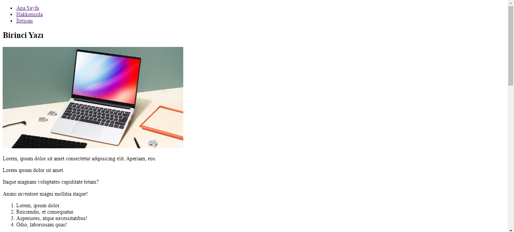
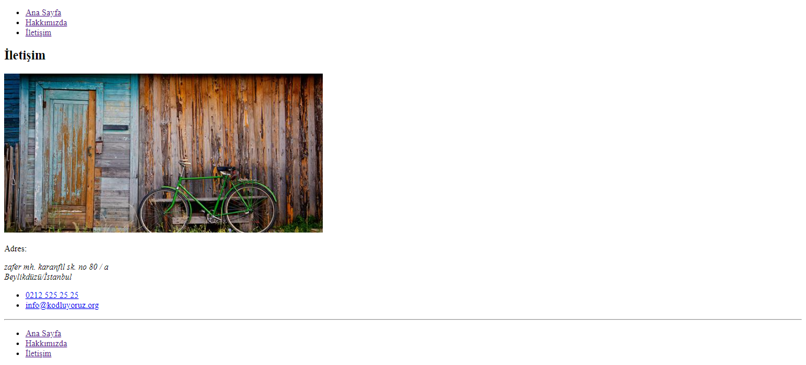
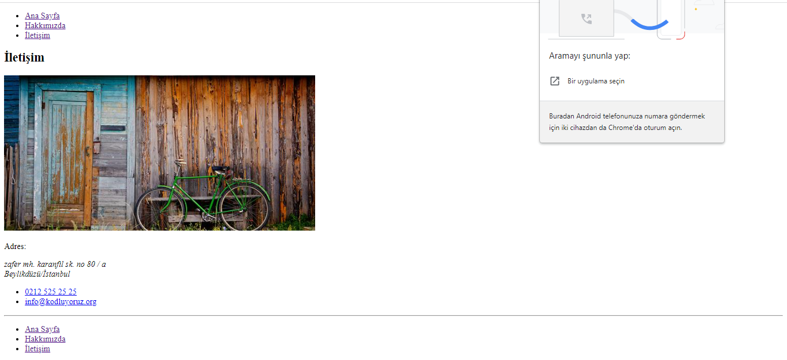
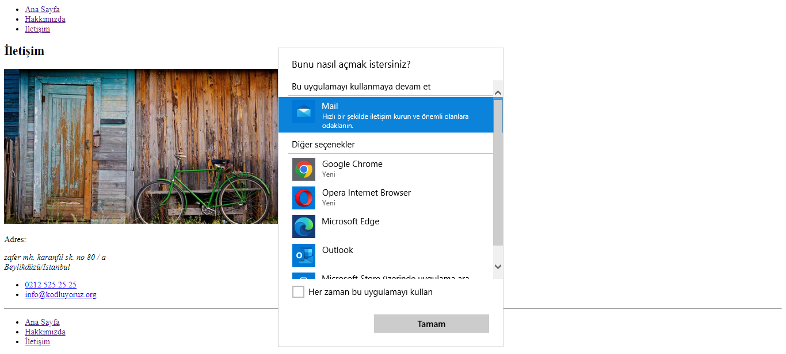

<h1><strong>Html Bölüm Sonu Çalışması</strong></h1>

Eğitim boyunca öğrendiğimiz tüm fonksiyonları kullanarak yaptığımız bu çalışma ile html eğitiminin sonuna geldik.

<ul>
<li>Yapımızı üç html dosyası ile oluşturduk.</li>
    <li>Sayfalar arası geçişleri tasarladık.</li>
    <li>Fotoğraflar ekledik.</li>
    <li>İletişim bilgilerini ulaşılabilir hale getirdik.</li>
    <li>Oluşumun kod kısmınıda sade ve anlaşılabilir şekilde 
    yazmaya özen gösterdik.</li>
     
     
     
    
    
